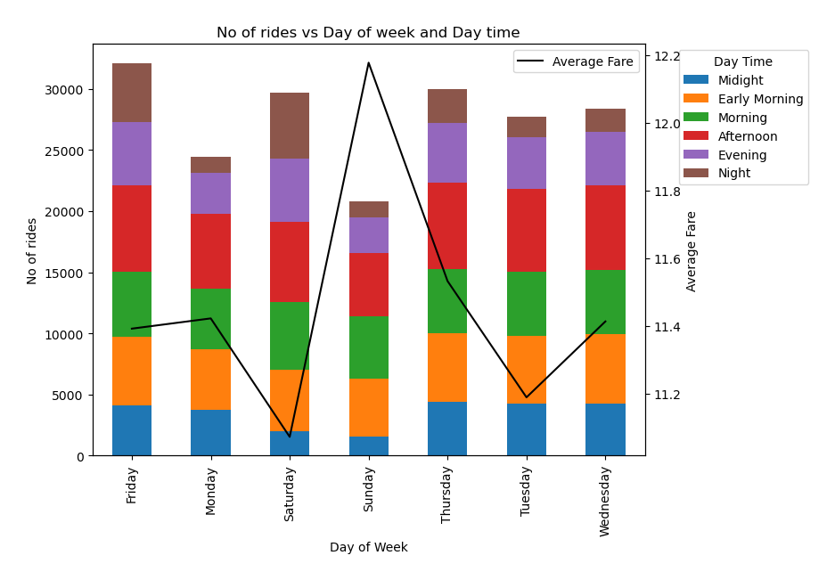
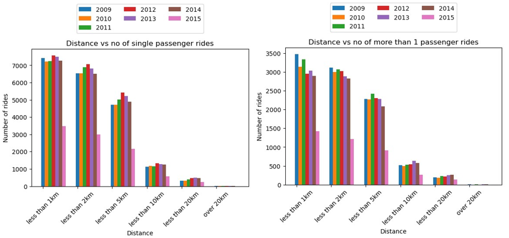
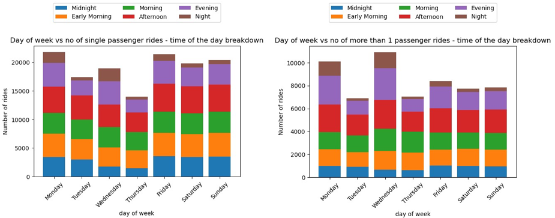

Presentation Slides:
https://docs.google.com/presentation/d/1Iri8kSvQENhwSOmUw6w_eDCUnLGMlLEBN9nV70BIWZc/edit?usp=sharing

Files and folders in Project1 repository

/Analysis
This folder contains output of charts generated by various code files.

/Resources
This folder contains the input data file. We have sources the input data file from Kaggle. 
https://www.kaggle.com/datasets/yasserh/uber-fares-dataset

Source for Inflation rate for New York city between 2009-2015
https://www.in2013dollars.com/New-York/price-inflation

This file contains following data for uber rides in New York city between 2009 to 2015.
key - a unique identifier for each trip
fare_amount - the cost of each trip in usd
pickup_datetime - date and time when the meter was engaged
passenger_count - the number of passengers in the vehicle (driver entered value)
pickup_longitude - the longitude where the meter was engaged
pickup_latitude - the latitude where the meter was engaged
dropoff_longitude - the longitude where the meter was disengaged
dropoff_latitude - the latitude where the meter was disengaged

We have used geoapify route planner api to calculate road distance for each API. After data cleaning output is saved as uber_data_processed.csv under resources folder.

#Adam code cleaning file name
#Add description

project1_pma_code.ipynb
Developer - Patricia de Assis

# Year & Season trends
#Analysis: 
  Overall during this period, there was an increase in average price from 2009-2015. From 2013 it is possible to see that as % of Inflation decreases the prices of Uber continue to increase. 
  During the same period of 2012, it is possible to see that the number of rides year on year started to decrease.
  the data shows that there are more rides during Spring, this could potentially be related to people having more of a wish to be out after the cold winter months. 
  Limitations for this analysis are that it is only possible to infer analysis over the selected data set and may not represent the behavior of a population of New York of total Uber rides shared measured by Uber. 

  #Average price of Uber fare during the period of 2009 and 2015 and relationship with % Inflation of the same period: 
    

    #Increase/Decrease of Uber rides year on year during the period of 2009-2015:
    Analysis/Patricia-Rides_Increase_per_year.png
    
    # Comparison of Total Number of rides between the 4 seasons in New York from 2009-2015:
    Analysis/Patricia-Total_Rides_Seasons.png

TimenDay.ipynb
Developer - Ekta Rangari
# Analysing the Impact of the Day and Time on Ride Demand
_________________________________________________________________
To understand the factors influencing ride demand on the Uber platform, a comprehensive analysis was conducted, focusing on the temporal aspects of user behavior.
Time Period Classification: The 24-hour day was segmented into six distinct categories to identify the most prevalent timeframes for Uber rides. This categorization aimed to capture variations in demand and rider preferences throughout different parts of the day and night.
Identifying Peak Usage Day: The study sought to determine the most frequently chosen day of the week for Uber rides. This involved analysing the volume of rides on each day to identify patterns and trends in user behavior.
Fare Classification:Average, maximum, and standard fares were classified to provide insights into the pricing dynamics during different time periods. This classification aimed to uncover variations in fare structures and understand how they relate to user demand.

Developer - Adam Faisal 

The bar plot depicting the average fare amount over distance intervals is crucial for unraveling Uber's pricing dynamics. This visualization offers a comprehensive overview of how average fares fluctuate across various road distance brackets. By discerning trends within these intervals, it becomes possible to identify patterns in pricing strategy. Anomalies or significant variations in average fares can be flagged, prompting further investigation into potential pricing disparities. This insight-driven approach aids in making informed decisions about optimizing fare structures, ensuring competitiveness, and aligning pricing with user expectations.

On the other hand, the scatter plot illustrating the relationship between road distance and fare amount provides a nuanced perspective. It facilitates a visual exploration of the correlation between these two variables for individual rides. Not only does this aid in the identification of outliers—instances of unusually high or low fares for specific distances—but it also offers valuable insights for predictive modeling. Uncovering patterns in the distribution of fare amounts concerning road distance lays the groundwork for refining predictive algorithms and optimizing pricing models. Overall, these visualizations serve as powerful tools for extracting actionable intelligence from Uber's rides dataset, guiding strategic decisions and enhancing the overall efficiency of the service.

DistanceAnalysis.ipynb
Developer - Leena Chauhan

# Single passenger vs more than 1 passenger trends
This code file compares how the choice to ride as single passenger or in group has changed over the years. Do people prefer to ride in group to save the cost? Has inflation affected people's choice to ride single or in a group? Following is the output.

It also compares choice of people to ride single or in a group based on day of the week and time of the day. Following is the output.

